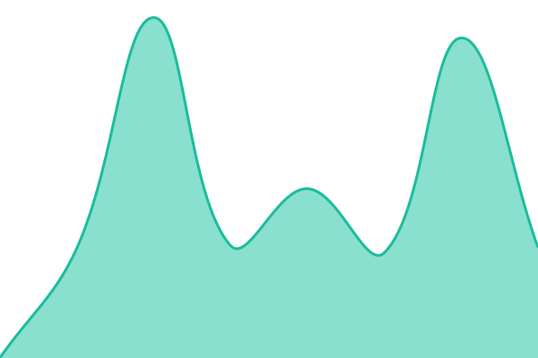

# [📈 Live Status](https://barangaroo.github.io/crosstabs-status): <!--live status--> **🟧 Partial outage**

This repository contains the open-source uptime monitor and status page for [barangaroo](https://barangaroo.github.io/crosstabs-status), powered by [Upptime](https://github.com/upptime/upptime).

With [Upptime](https://upptime.js.org), you can get your own unlimited and free uptime monitor and status page, powered entirely by a GitHub repository. We use [Issues](https://github.com/barangaroo/crosstabs-status/issues) as incident reports, [Actions](https://github.com/barangaroo/crosstabs-status/actions) as uptime monitors, and [Pages](https://barangaroo.github.io/crosstabs-status) for the status page.

<!--start: status pages-->
<!-- This summary is generated by Upptime (https://github.com/upptime/upptime) -->
<!-- Do not edit this manually, your changes will be overwritten -->
<!-- prettier-ignore -->
| URL | Status | History | Response Time | Uptime |
| --- | ------ | ------- | ------------- | ------ |
|  [Crosstabs API health](https://www.crosstabs.com/api/health) | 🟩 Up | [crosstabs-api-health.yml](https://github.com/barangaroo/crosstabs-status/commits/HEAD/history/crosstabs-api-health.yml) | 

 274ms
     
 | 

<a href="https://barangaroo.github.io/crosstabs-status/history/crosstabs-api-health">100.00%</a>
    

|  [Crosstabs headless surface status](https://ai.crosstabs.com/api/headless-status) | 🟥 Down | [headless-surface-status.yml](https://github.com/barangaroo/crosstabs-status/commits/HEAD/history/headless-surface-status.yml) | 

 82ms
     
 | 

<a href="https://barangaroo.github.io/crosstabs-status/history/headless-surface-status">0.00%</a>
    

|  [Crosstabs MCP OAuth resource discovery](https://mcp.crosstabs.com/.well-known/oauth-protected-resource/mcp) | 🟥 Down | [mcp-oauth-resource.yml](https://github.com/barangaroo/crosstabs-status/commits/HEAD/history/mcp-oauth-resource.yml) | 

 484ms
     
 | 

<a href="https://barangaroo.github.io/crosstabs-status/history/mcp-oauth-resource">0.00%</a>
    

|  [Crosstabs MCP initialize](https://mcp.crosstabs.com/mcp) | 🟥 Down | [mcp-initialize.yml](https://github.com/barangaroo/crosstabs-status/commits/HEAD/history/mcp-initialize.yml) | 

 461ms
     
 | 

<a href="https://barangaroo.github.io/crosstabs-status/history/mcp-initialize">0.00%</a>
    

|  [Crosstabs public MCP catalog](https://mcp.crosstabs.com/mcp) | 🟩 Up | [mcp-public-catalog.yml](https://github.com/barangaroo/crosstabs-status/commits/HEAD/history/mcp-public-catalog.yml) | 

 712ms
     
 | 

<a href="https://barangaroo.github.io/crosstabs-status/history/mcp-public-catalog">100.00%</a>
    

|  [Crosstabs rich MCP result](https://mcp.crosstabs.com/mcp) | 🟥 Down | [mcp-rich-result.yml](https://github.com/barangaroo/crosstabs-status/commits/HEAD/history/mcp-rich-result.yml) | 

 370ms
     
 | 

<a href="https://barangaroo.github.io/crosstabs-status/history/mcp-rich-result">0.00%</a>
    

|  [Crosstabs MCP widget resource](https://mcp.crosstabs.com/mcp) | 🟥 Down | [mcp-widget-resource.yml](https://github.com/barangaroo/crosstabs-status/commits/HEAD/history/mcp-widget-resource.yml) | 

 532ms
     
 | 

<a href="https://barangaroo.github.io/crosstabs-status/history/mcp-widget-resource">0.00%</a>
    

<!--end: status pages-->

[**Visit our status website →**](https://barangaroo.github.io/crosstabs-status)

## 📄 License

- Powered by: [Upptime](https://github.com/upptime/upptime)
- Code: [MIT](./LICENSE) © [Anand Chowdhary](https://anandchowdhary.com)
- Data in the `./history` directory: [Open Database License](https://opendatacommons.org/licenses/odbl/1-0/)
